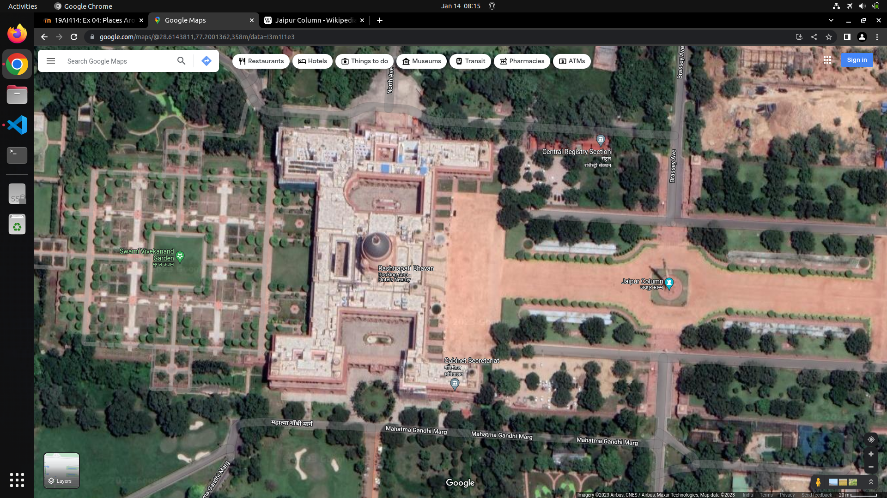

# Places Around Me
# Aim:
To develop a website to display details about the places around Rashtrapati Bhawan.

# Design Steps:
## Step 1
Create a new django project and app

## Step 2
Add a new imagemap html file

## Step 3
Type ur image map code in the html with coordinates and target file to redirect on click
## Step 4
Define your components pages and create content in such a way that it gives information about place which is being clicked
## Step 5
Include pictures and contents for your subpages in Repository file

# Code:
### Main HTML File
t.html
```

<!DOCTYPE html>
<html>


<map name="image-maps-2023-01-20-081037" id="ImageMapsCom-image-maps-2023-01-20-081037">
<area  alt="" title="" href="/home/sec/django/EX04/mughal.html" shape="rect" coords="37,116,372,444" style="outline:none;" target="_self"     />
<area  alt="" title="" href="/home/sec/django/EX04/rastrapati.html" shape="rect" coords="421,209,658,361" style="outline:none;" target="_self"     />
<area  alt="" title="" href="/home/sec/django/EX04/cabinet.html" shape="rect" coords="564,415,709,504" style="outline:none;" target="_self"     />
<area  alt="" title="" href="/home/sec/django/EX04/centralreg.html" shape="rect" coords="730,68,875,157" style="outline:none;" target="_self"     />
<area  alt="" title="" href="/home/sec/django/EX04/jaipurcolumn.html" shape="rect" coords="859,277,1042,366" style="outline:none;" target="_self"     />
<area shape="rect" coords="1342,537,1344,539" alt="Image Map" style="outline:none;" title="Image Map" href="https://www.image-maps.com/" />
</map>
</html>
```


# Output:



# Result:
Thus a website is developed to display details about the places around Rashtrapati Bhawan.


